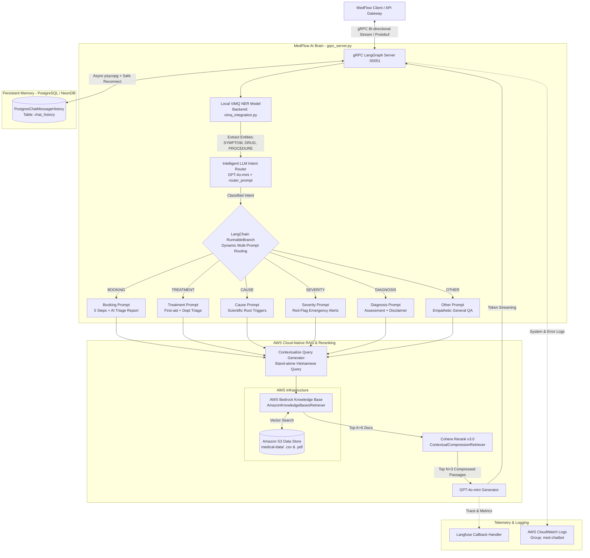

The **`medflow-ai`** module is engineered as an autonomous microservice running on port `50051`, utilizing the **gRPC** protocol for high-throughput, bidirectional streaming. Extending far beyond the capabilities of a standard medical Q&A chatbot, `medflow-ai` acts as an authoritative **AI Medical Triage & Clinical Decision Support System (CDSS)**.

The system seamlessly ingests patient symptom narratives, extracts precise clinical entities, evaluates risk severity, assigns appropriate medical specialties, and orchestrates appointment scheduling into the hospital management infrastructure.

---

### `medflow-ai` Ecosystem Architectural Flow

The following Mermaid diagram depicts the end-to-end processing pipeline from initial gRPC connection handling to deep reasoning across AWS Bedrock and PostgreSQL infrastructures:

---

### Core Architectural Components

1. **Bi-directional gRPC Streaming Gateway (`LangGraphServicer`)**:  
   Receives Protobuf-serialized connections and manages real-time input/output streaming, eliminating HTTP handshake overhead and dispatching diagnostic tokens back to the client the instant they are generated by the LLM.

2. **Local Neural Entity Extraction Engine (`ViMQ NER Inferencer`)**:  
   A specialized deep learning model hosted directly in server RAM, dedicated to understanding Vietnamese clinical text and extracting medical entities (Symptoms, Drugs, Clinical Procedures) prior to intent classification.

3. **Intelligent Intent Router & Dynamic Branching (`Intelligent Router & RunnableBranch`)**:  
   Synthesizes conversational context with extracted medical entities to dynamically route user queries into exactly 1 of 6 domain-specific Prompt pipelines (`BOOKING`, `TREATMENT`, `CAUSE`, `SEVERITY`, `DIAGNOSIS`, `OTHER`).

4. **Cloud-Native Managed RAG Engine**:  
   Leverages fully managed **AWS Bedrock Knowledge Bases** synchronized with **Amazon S3** clinical repositories, paired with **Cohere Rerank v3.0** precision filtering to extract authoritative medical citations.

5. **Persistent Conversational Memory Layer**:  
   Utilizes relational cloud database storage (PostgreSQL / NeonDB) equipped with automated connection self-healing (`Safe Reconnect`), guaranteeing uninterrupted patient consultation histories across sessions.

6. **Dual-Layer Telemetry & Observability**:  
   Monitors end-to-end execution latency, token economics, and financial expenditure via **Langfuse**, while simultaneously exporting system error logs to **AWS CloudWatch Logs** to meet production-grade reliability standards.

---
*Proceed to the next section: **[2. ViMQ NER Deep Dive: Architecture, Dataset & Training Algorithms](../5.3.2-vimq-ner-deep-dive/)**.*
