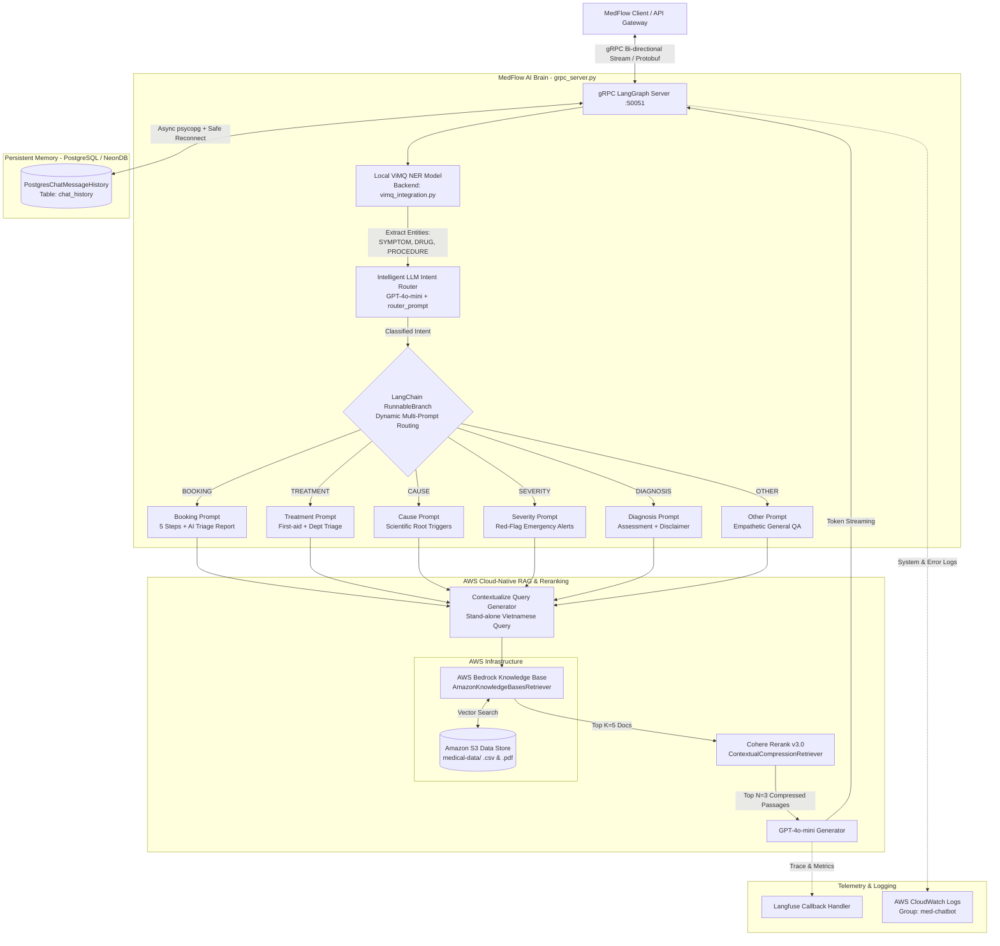

Module **`medflow-ai`** được thiết kế dưới dạng một vi dịch vụ (microservice) độc lập chạy trên cổng `50051`, sử dụng giao thức **gRPC** để truyền phát dữ liệu tốc độ cao. Vượt xa giới hạn của một chatbot hỏi đáp y tế thông thường, `medflow-ai` đóng vai trò là một **Trợ lý Sơ loại Bệnh nhân & Hỗ trợ Quyết định Lâm sàng (AI Medical Triage & Clinical Decision Support - CDSS)** chuyên nghiệp.

Hệ thống có khả năng tiếp nhận lời khai triệu chứng từ bệnh nhân, bóc tách thực thể y khoa chính xác, đánh giá và phân loại mức độ nguy hiểm, chỉ định chuyên khoa phù hợp và hướng dẫn đặt lịch hẹn mượt mà vào hệ thống quản lý bệnh viện.

---

### Sơ Đồ Kiến Trúc Hệ Sinh Thái `medflow-ai`

Dưới đây là kiến trúc luồng xử lý toàn phần của module từ khi tiếp nhận truy vấn tại cổng gRPC cho đến khi suy luận cùng hạ tầng Đám mây AWS Bedrock và PostgreSQL:

---

### Các Thành Phần Lõi Trong Kiến Trúc

1. **Cổng Giao Tiếp gRPC Bi-directional Streaming (`LangGraphServicer`)**:  
   Tiếp nhận kết nối theo chuẩn Protobuf, quản lý luồng dữ liệu song hướng (stream in/out) giúp loại bỏ độ trễ khởi tạo HTTP, gửi từng token phân tích về cho Client ngay khi LLM vừa sinh ra.

2. **Lõi Xử Lý Thực Thể Cục Bộ (`ViMQ NER Inferencer`)**:  
   Mô hình học sâu chạy trực tiếp trên bộ nhớ máy chủ, chịu trách nhiệm đọc hiểu văn bản tiếng Việt và bóc tách các thực thể y khoa (Triệu chứng, Dược phẩm, Thủ thuật lâm sàng) trước khi đưa vào luồng định tuyến.

3. **Bộ Định Tuyến Ý Định & Phân Nhánh Năng Động (`Intelligent Router & RunnableBranch`)**:  
   Phân tích ngữ cảnh hội thoại kết hợp cùng các thực thể đã bóc tách để định tuyến câu hỏi vào đúng 1 trong 6 luồng Prompt chuyên biệt (`BOOKING`, `TREATMENT`, `CAUSE`, `SEVERITY`, `DIAGNOSIS`, `OTHER`).

4. **Hệ Thống RAG Quản Lý Trên Đám Mây (Cloud-Native RAG Engine)**:  
   Tích hợp dịch vụ quản lý hoàn toàn **AWS Bedrock Knowledge Bases** liên kết với hồ sơ lưu trữ **Amazon S3**, kết hợp mô hình chấm điểm lại **Cohere Rerank v3.0** để trích xuất tri thức chuẩn lâm sàng.

5. **Tầng Quản Lý Ngữ Cảnh Bền Vững (`Persistent Memory Layer`)**:  
   Sử dụng cơ sở dữ liệu quan hệ Cloud (PostgreSQL / NeonDB) với cơ chế tự phục hồi kết nối (`Safe Reconnect`), duy trì tính liên tục của lịch sử tư vấn y tế cho từng bệnh nhân.

6. **Hệ Thống Giám Sát Kép (`Observability & Telemetry`)**:  
   Theo dõi độ trễ, mức độ tiêu thụ token và chi phí bằng **Langfuse**, đồng thời ghi nhận toàn bộ log lỗi hệ thống lên **AWS CloudWatch Logs** theo chuẩn vận hành hệ thống cấp sản xuất (Production-grade).

---
*Chuyển sang chuyên đề tiếp theo: **[2. Chuyên Sâu Về Mô Hình ViMQ: Kiến Trúc, Dữ Liệu & Thuật Toán Huấn Luyện](../5.3.2-vimq-ner-deep-dive/)**.*
